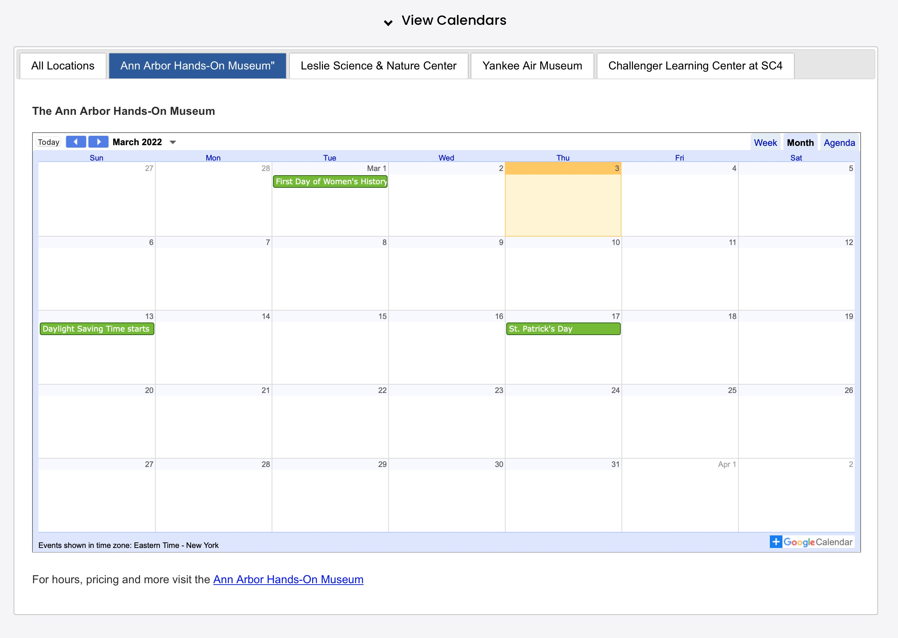
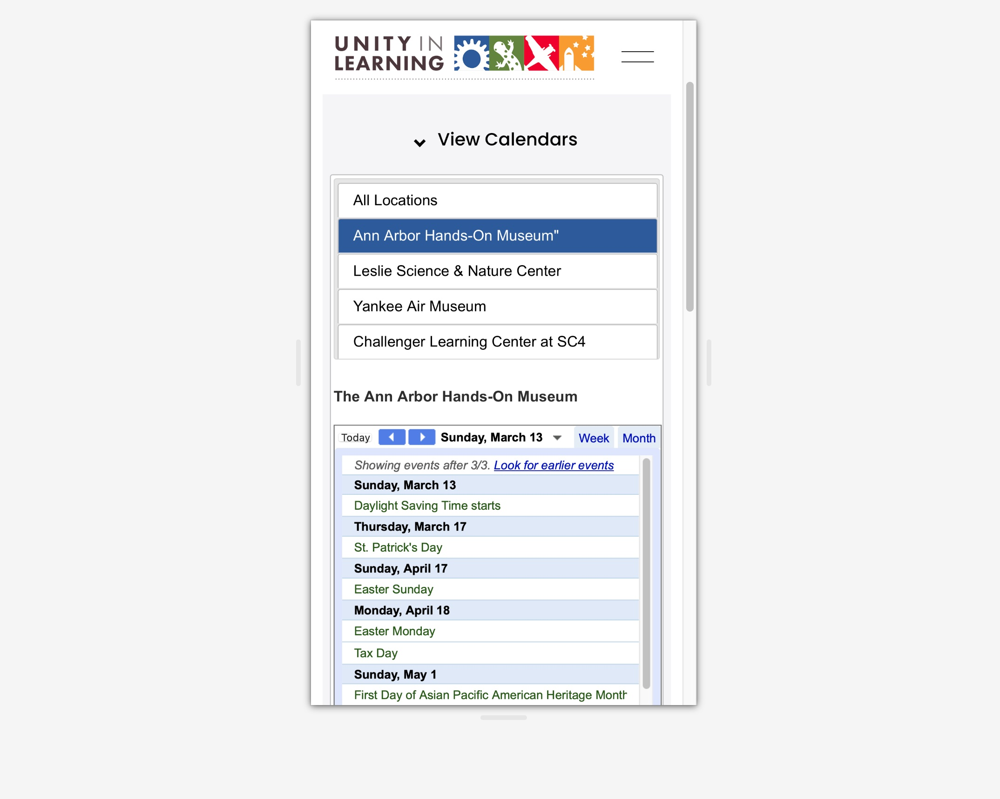

### Calendar of Events

The calendar custom function grabs data from the reference-data blog "Calendars"

**Used On Pages**

*About Us -> Calendars*
*Visit -> Leslie*

**Usage**

*collectionControl(Selector, Collection Slug, Display Type, Attributes)*

**Parameters:**

<table class="ws-table-all notranslate">
  <tbody>
    <tr class="tableTop">
     <td style="width:120px">Parameter</td>
     <td>Description</td>
    </tr>
    <tr>
      <td><em>Selector</em></td>
      <td>Required.<br>jQuery selector identification where the resulting html code will be generated.  Note that the selector must be unique on the page.</td>
    </tr>
    <tr>
      <td><em>Collection Slug</em></td>
      <td>No defined collection is needed, leave blank.</td>
    </tr>
    <tr>
      <td><em>Display Type</em></td>
      <td>Required.<br>Identifies the display type requested.  For calendars must be "calendars".  These are case sensitive parameters. </td>
    </tr>
    <tr>
      <td><em>Attributes</em></td>
      <td>Optional.<br>Identifies parameters to override default values.  The parameters are passed in a object array of key/value pairs.  Each display type has different default values as described below. </td>
    </tr>
  </tbody>
</table>

**Attributes:**

<table class="ws-table-all notranslate">
  <tbody>
    <tr class="tableTop">
     <td style="width:120px">Attribute</td>
     <td>Description</td>
     <td>Default</td>
    </tr>
    <tr>
      <td>ActiveTab</td>
      <td>Optional.
        <ul>
          <li>0=All museums (Default)</li>
          <li>1=Ann Arbor Hands On</li>
          <li>2=Leslie Science</li>
          <li>3=Yankee Air Museum</li>
          <li>4=Challenger Learning center</li>
        </ul>
     </td>
     <td>0</td>
    </tr>
    <tr>
      <td>single</td>
      <td>Only show the active tab</td>
      <td>False</td>
    </tr>
    <tr>
      <td><em>openfirst</em></td>
      <td>Optional.<br>
      Determins if the first accordian group is initially expanded or not
        <ul>
          <li>True=Initially collapsed</li>
          <li>False=Initially expanded (default)</li>
        </ul>
      </td>
      <td>False</td>
    </tr>
    <tr>
      <td>Collapasble</td>
      <td>Optional.
        <ul>
          <li>True=Can be collapsed or expanded (Default)</li>
          <li>False=Not collapsable</li>
        </ul>
      </td>
      <td>True</td>
    </tr>
    <tr>
      <td><em>Collapsed</em></td>
      <td>Optional.<br>
      Collapsable must be set to true, otherwise this paramter is ignored.
        <ul>
          <li>True=Initially collapsed</li>
          <li>False=Initially expanded (default)</li>
        </ul>
      </td>
      <td>False</td>
    </tr>
    <tr>
      <td>title</td>
      <td>The title that will be displayed if collapsable</td>
      <td>View Calendars</td>
    </tr>
    <tr>
      <td>showPrint</td>
      <td>Google calendar parameter to show print link.</td>
      <td>False</td>
    </tr>
    <tr>
      <td>showTabs</td>
      <td>Google calendar parameter to show week, month, agenda tabs.</td>
      <td>False</td>
    </tr>
    <tr>
      <td>showTitle</td>
      <td>Google calendar parameter to show calendar title.</td>
      <td>False</td>
    </tr>
    <tr>
      <td>showName</td>
      <td>Google calendar parameter to show calendar name.</td>
      <td>False</td>
    </tr>
    <tr>
      <td>showNav</td>
      <td>Google calendar parameter to show next page navigation.</td>
      <td>True</td>
    </tr>
    <tr>
      <td>showDate</td>
      <td>Google calendar parameter to show date.  default = true</td>
      <td>True</td>
    </tr>
    <tr>
      <td>showTz</td>
      <td>Google calendar parameter to show time zone.  default = true</td>
      <td>True</td>
    </tr>
    <tr>
      <td>showCalendars</td>
      <td>Google calendar parameter to show dropdown menu of calendar list.</td>
      <td>False</td>
    </tr>
    <tr>
      <td>mode</td>
      <td>Calendar mode, MONTH, WEEK, AGENDA.</td>
      <td>MONTH</td>
    </tr>
    <tr>
      <td>ctz</td>
      <td>Time zone</td>
      <td>America%2FNew_York</td>
    </tr>
  </tbody>
</table>

**Example code block for control**

```
<script>
$(document).ready(function() {
  collectionControl(
    '#calendarsOut',
    '',
    'calendars',
    {activetab: 1,
     single: false,
     openFirst: false,
     collapsable: false,
     collapsed: false,
     title: "View Calendars",
     showPrint: false,
     showTabs: false,
     showTitle: false,
     showName: false,
     showNav: true,
     showDate: true,
     showTz: true,
     mode: "MONTH",
     showCalendars: false}
  );
})
</script>
<div id="calendarsOut"></div>
```

**Reference Data**

*reference-data blog: Calendars (code block)*

**CSV Calendar File:**

<table class="ws-table-all notranslate">
  <tbody>
    <tr class="tableTop">
     <td style="width:120px">Column</td>
     <td>Description</td>
    </tr>
    <tr>
      <td>Museum</td>
      <td>Museum abbreviation name, one of "unity", "aahom", "leslie",
      "challenger", "experience"</td>
    </tr>
    <tr>
      <td>Calendar ID</td>
      <td>ID from Google Calendars</td>
    </tr>
    <tr>
      <td>Link</td>
      <td>Link to related page</td>
    </tr>
  </tbody>
</table>

**Overrides:**

You can dynamically override *ActiveTab* by adding a parameter to the linking url as:

```
?tab=n  (where n is a number from 0-4, see ActiveTab below)
```


**Return Value:**

None

**Calendar desktop view**



**Calendar mobile view**

