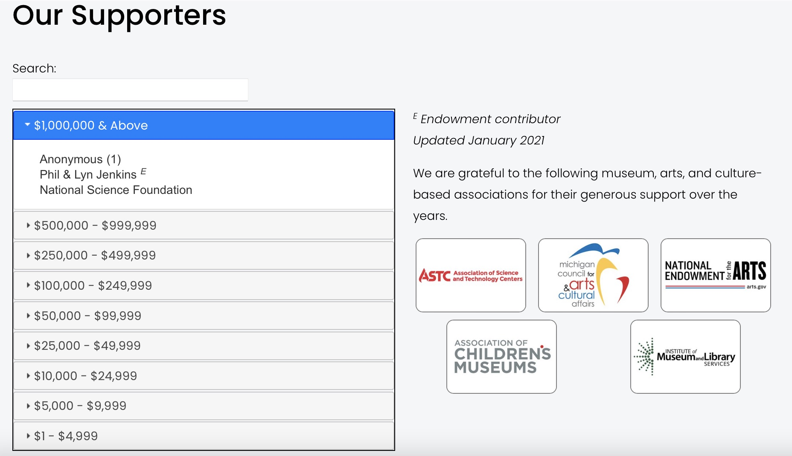

### Donor Wall

List of donors

Lists of donors in accordian style by defined breakpoints.

**Used On Pages**

*About Us -> Our Supporters*

**Usage**

*collectionControl(Selector, Collection Slug, Display Type, Attributes)*

**Parameters:**

<table class="ws-table-all notranslate">
  <tbody>
    <tr class="tableTop">
     <td style="width:120px">Parameter</td>
     <td>Description</td>
    </tr>
    <tr>
      <td><em>Selector</em></td>
      <td>Required.<br>jQuery selector identification where the resulting html code will be generated.  Note that the selector must be unique on the page.</td>
    </tr>
    <tr>
      <td><em>Collection Slug</em></td>
      <td>No defined collection is needed, leave blank.</td>
    </tr>
    <tr>
      <td><em>Display Type</em></td>
      <td>Required.<br>Identifies the display type requested.  For donors must be "donorWall".  These are case sensitive parameters. </td>
    </tr>
    <tr>
      <td><em>Attributes</em></td>
      <td>Optional.<br>Identifies parameters to override default values.  The parameters are passed in a object array of key/value pairs.  Each display type has different default values as described below. </td>
    </tr>
  </tbody>
</table>

**Attributes:**

<table class="ws-table-all notranslate">
  <tbody>
    <tr class="tableTop">
     <td style="width:120px">Attribute</td>
     <td>Description</td>
    </tr>
    <tr>
      <td>collapsable</td>
      <td>Defines if the entire accordian can be collapsed into a single link.  This is different than the individual accordian of the breakpoints.  Must be "true" or "false", default is "false"</td>
    </tr>
    <tr>
      <td>collapsed</td>
      <td>This is in reference to the individual breakpoints.  Normally only the first one is expended on entry.  Must be "true" or "false", default is "true"</td>
    </tr>
    <tr>
      <td>title</td>
      <td>The title that will be displayed if collapsable</td>
    </tr>
  </tbody>
</table>


**Example code block for control**

```
<script>
<script>
$( document ).ready(function() {
  collectionControl(
    '#donorWall',
    '',
    'donorwall',
    {collapsable: false,
     collapsed: true,
     title: "This is the title"}
  );
});
</script>
<div id="donorWall"></div>
```

**Example Screenshot**


