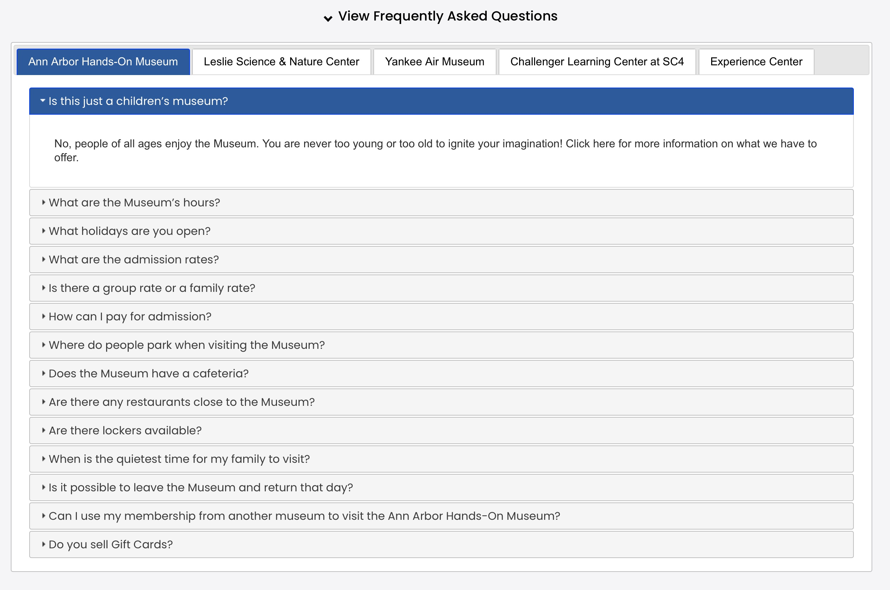

### Frequently Asked Questions

The Frequently Asked Questions custom function grabs data from "reference-data" blog entry title "FAQS" and displays the questions/answers in an accordian style list.  Each museum will have a separate tab, and separate questions based on data from the spreadsheet.

The frequently asked questions block is emplimented by adding a code block to the page with the following:

**Code block for frequently asked questions**
```
<script>
$( document ).ready(function() {
  collectionControl(
    '#faqsDiv',
    '',
    'faqs',
    {
      collapsable: true,
      collapsed: false,
      openfirst: true
    }
  );
});
</script>
<div id="faqsDiv"></div>
```
*Note:* This example will place the resulting html code in the #faqsDiv selector (Selector).  The second tab (ActiveTab) will be selected (Leslie Science).  Since Single is set as false, all museum tabs will be visible.  If Single was set to true then only Leslie Science would be showing.  OpenFirst is set to true, which says that the first question will be automatically open on the initial display (unless on mobile). Collapsable is set to true, which says to add an expand/collapse toggle link above the tabs.  Collapsed being false, says that the tabs will be initially expanded when page is first visited.

**Overrides:**

You can dynamically override *ActiveTab* by adding a parameter to the linking url as:

```
?tab=n  (where n is a number from 1-4, see ActiveTab below)
```

**Usage:**

*collectionControl(Selector, Collection Slug, Display Type, Attributes)*

**Parameters:**

<table class="ws-table-all notranslate">
  <tbody>
    <tr class="tableTop">
     <td style="width:120px">Parameter</td>
     <td>Description</td>
    </tr>
    <tr>
      <td>Selector</td>
      <td>Required.<br>jQuery selector identification where the resulting html code will be generated.  Note that the selector must be unique on the page.</td>
    </tr>
    <tr>
      <td>Collection Slug</td>
      <td>No defined collection is needed, leave blank.</td>
    </tr>
    <tr>
      <td><em>Display Type</em></td>
      <td>Required.<br>Identifies the display type requested.  For frequently asked questions must be "**faqs**".  These are case sensitive parameters values. </td>
    </tr>
    <tr>
      <td><em>Attributes</em></td>
      <td>Optional.<br>Identifies parameters to override default values.  The parameters are passed in a object array of key/value pairs.  Each display type has different default values as described below. </td>
    </tr>
  </tbody>
</table>

**Attributes:**

<table class="ws-table-all notranslate">
  <tbody>
    <tr class="tableTop">
     <td style="width:120px">Attribute</td>
     <td>Description</td>
    </tr>
    <tr>
      <td><em>Collapasble</em></td>
      <td>Optional.
        <ul>
          <li>True=Can be collapsed or expanded (Default)</li>
          <li>False=Not collapsable</li><li>true=Can be collapsed or expanded (Default)</li>
        </ul>
      </td>
    </tr>
    <tr>
      <td><em>Collapsed</em></td>
      <td>Optional.<br>
      Collapsable must be set to true, otherwise this paramter is ignored.
        <ul>
          <li>True=Initially collapsed</li>
          <li>False=Initially expanded (default)</li>
        </ul>
      </td>
    </tr>
    <tr>
      <td><em>openfirst</em></td>
      <td>Optional.<br>
      Determins if the first accordian group is initially expanded or not
        <ul>
          <li>True=Initially collapsed</li>
          <li>False=Initially expanded (default)</li>
        </ul>
      </td>
    </tr>
    <tr>
      <td>title</td>
      <td>The title that will be displayed if collapsable</td>
    </tr>
    <tr>
      <td>activetab</td>
      <td>Optional.  Expecting a number from 1-4 indicating the museum.
        <ul>
          <li>1=Ann Arbor Hands On (Default)</li>
          <li>2=Leslie Science</li>
          <li>3=Yankee Air Museum</li>
          <li>4=Challenger Learning center</li>
        </ul></td>
    </tr>
    <tr>
      <td>Single</td>
      <td>Optional.
        <ul>
          <li>True=Show only the active museum tab.</li>
          <li>False=All museums (Default)</li>
        </ul>
      </td>
    </tr>
    <tr>
      <td><em>OpenFirst</em></td>
      <td>Optional.
        <ul>
          <li>True=Automatically open the first faq question for the selected museum.</li>
          <li>False=All faq questions closed on initial open. (Default)</li>
        </ul>
      </td>
    </tr>
  </tbody>
</table>

**Return Value:**

None

**Google Spreadsheet:  NOT USED**

<table class="ws-table-all notranslate"> 
  <tbody>
    <tr class="tableTop">
     <td style="width:120px">Detail</td>
     <td>Description</td>
    </tr>
    <tr>
      <td>Owner</td>
      <td>aahom220@gmail.com</td>
    </tr>
    <tr>
      <td>File Name</td>
      <td>FAQs</td>
    </tr>
    <tr>
      <td>Folder</td>
      <td><a href="https://drive.google.com/drive/folders/1YaVLSr9quHsbMDChBrlZUjpI_ZeG0cG-" target="_blank">UIL_Web_Site_Docs</a></td>
    </tr>
    <tr>
      <td>Link</td>
      <td><a href="https://docs.google.com/spreadsheets/d/1f3G-ECzjt8p-czZNPyUQGXG8NND016Nue5QypQTf6PQ/edit#gid=0" target="_blank">FAQs Spreadsheet</a></td>
    </tr>
    <tr>
      <td>ID</td>
      <td>1f3G-ECzjt8p-czZNPyUQGXG8NND016Nue5QypQTf6PQ</td>
    </tr>
    <tr>
      <td>Sheet Name</td>
      <td>FAQS</td>
    </tr>
  </tbody>
</table>

**Spreadsheet Fields**

<table class="ws-table-all notranslate"> 
  <tbody>
    <tr class="tableTop">
    <td style="width:20px">Column</td>
    <td style="width:120px">Label</td>
    <td>Description</td>
    </tr>
    <tr>
    <td>A</td>
    <td>List</td>
    <td>The museum code
    <ul>
          <li>unity=Unity in learning general</li>
          <li>aahom=Ann Arbor Hands On</li>
          <li>leslie=Leslie Science</li>
          <li>yankee=Yankee Air Museum</li>
          <li>experience=Experience Center</li>
          <li>challenger=Challenger Learning center</li>
        </ul>
    </td>
  </tr>
  <tr>
    <td>B</td>
    <td>Category</td>
    <td>Not used</td>
  </tr>
  <tr>
    <td>C</td>
    <td>Hide</td>
    <td>Hide this question if value=Yes</td>
  </tr>
  <tr>
    <td>D</td>
    <td>Question</td>
    <td>The faq question</td>
  </tr>
  <tr>
    <td>E</td>
    <td>Answer</td>
    <td>The answer</td>
    </tr>
  </tbody>
</table>

**Example Screenshot**


