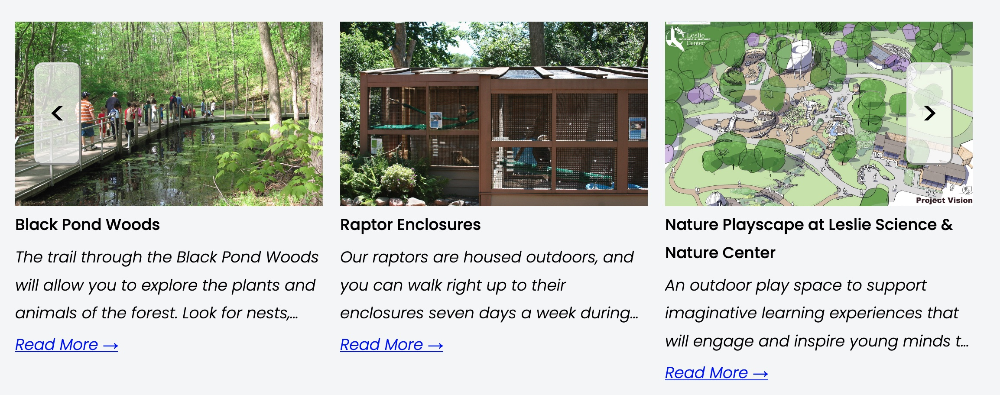
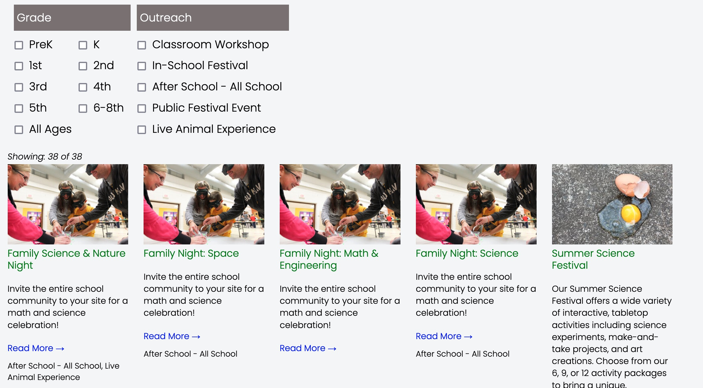
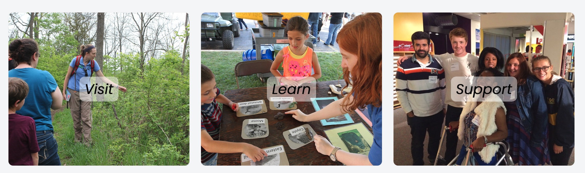
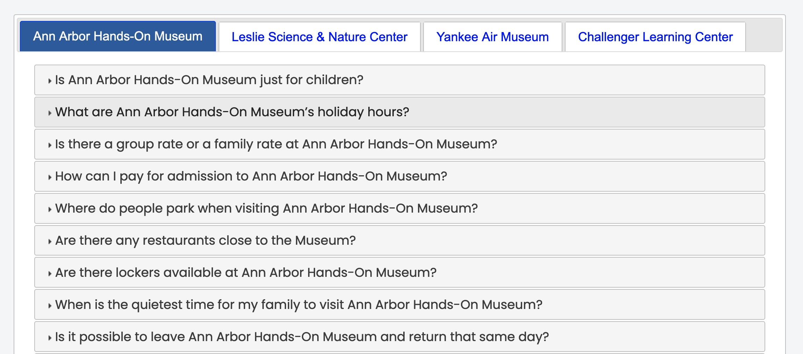
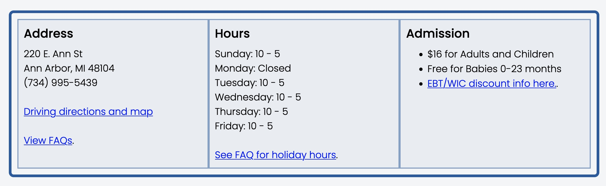
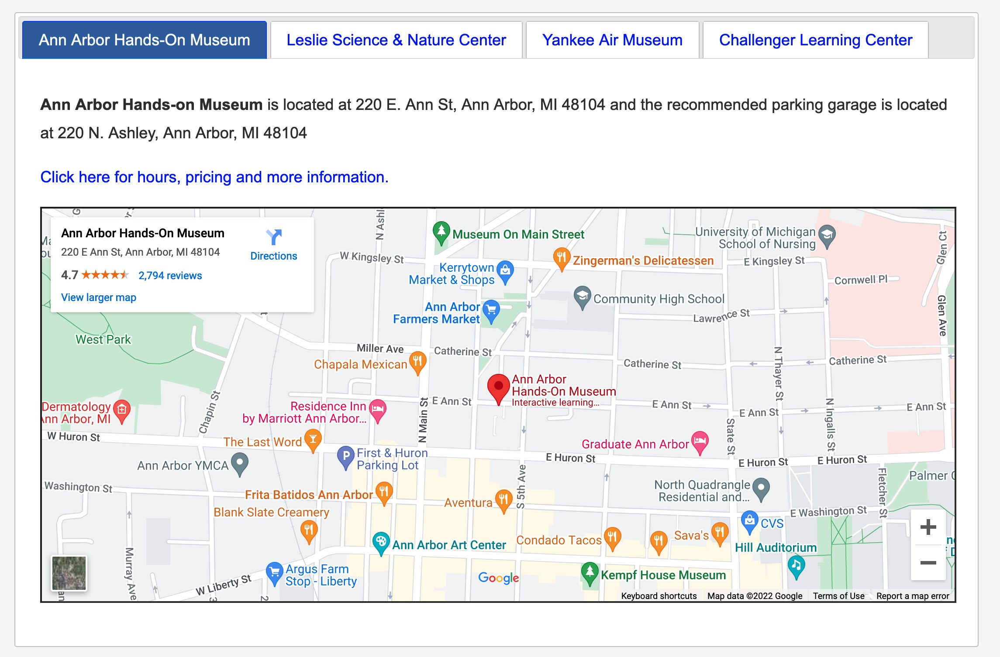
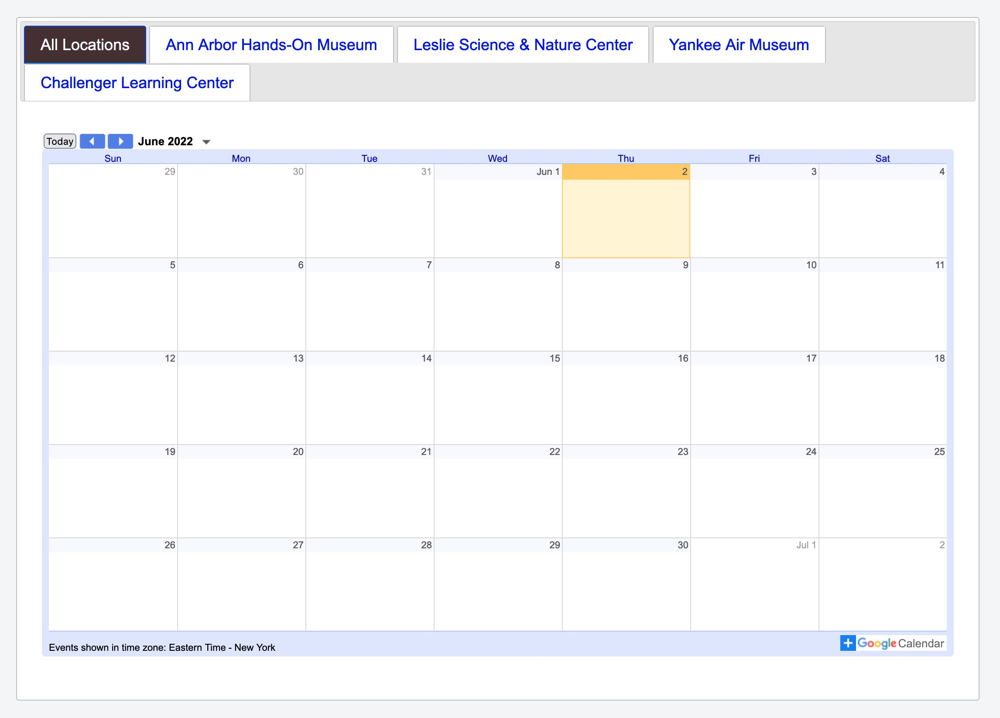
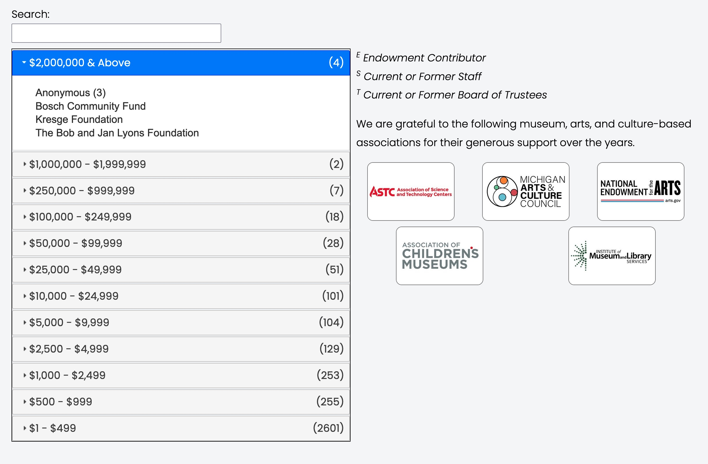
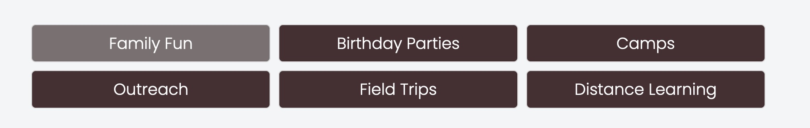

# Components Home

This is a quick review of the tools available in the UIL Toolbox.   These tools generally present data from **SquareSpace Collections**.   Collections are files of either Blogs or Events.

## Carousel

The Carousel is an infinint loop of entries in a collection with previous and next
buttons on the left and right.  The number of items displayed can be defined as an
attribute when calling the carousel function.  Filtering (to limit items) based on SquareSpace categories is also available via attributes. [Learn More about carousels](../components/carousel.html).

## Filtered Grid

This will display a SquareSpace collection (blog or events) as a grid with optional
filtering based on defined groups (see reference-data).  [Learn More about grids](../components/grids.html).

## Icon Bar

Icon Bars appear either attached to the top header image and/or the bottom footer on
all pages.  The icons displayed are saved in /reference-data/iconbar.  [Learn More about Icon Bars](../components/iconbar_new.html).

## Team Members

A list of team members found in the SquareSpace blog “Team Members” can be displayed via the custom function collectionControl by embedding a code block on a page. [Learn More about Icon Bars](../components/teamboxes.html).

## Flip Boxes

## Frequently Asked Questions

## Address/Hours/Admission

## Locations

## Calendars

## Donor Wall

## Sub Menu

