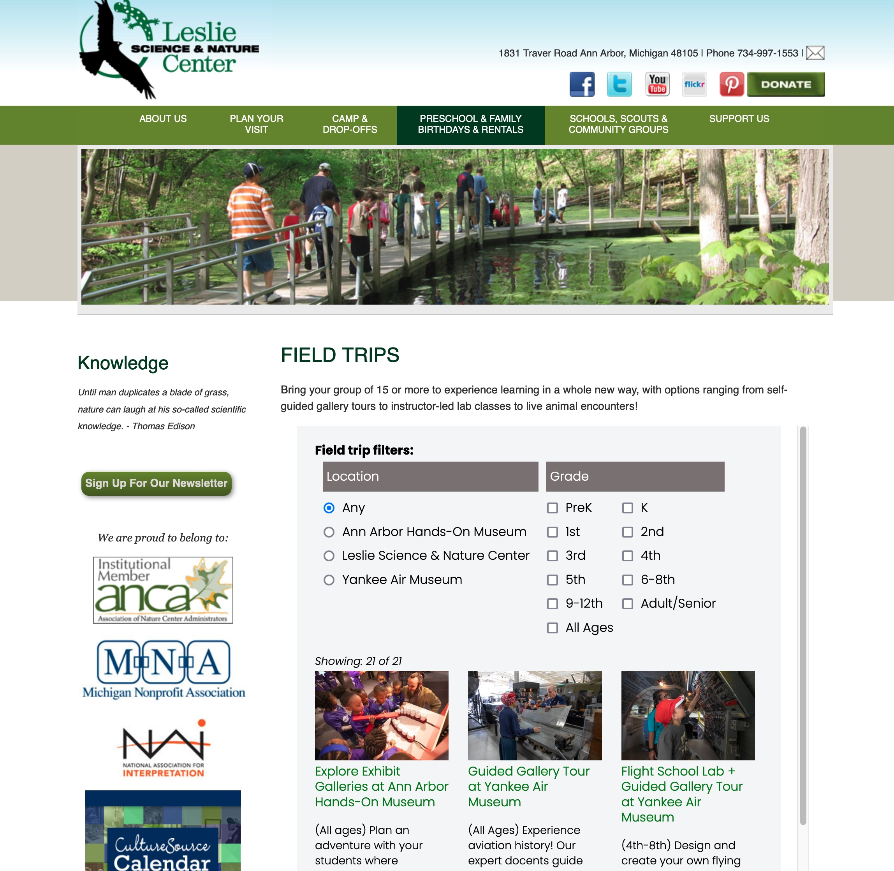

### Embedded Iframe

You can embed a page from the UIL website into the page of a separate website.  When this is done, headers and footers are hidden with "display:none" CSS attribute. Otherwise this is a basic iFrame embed and initial height/width will be honored.

Under construction

**Menu Bar Screenshot**

{: .theImage}