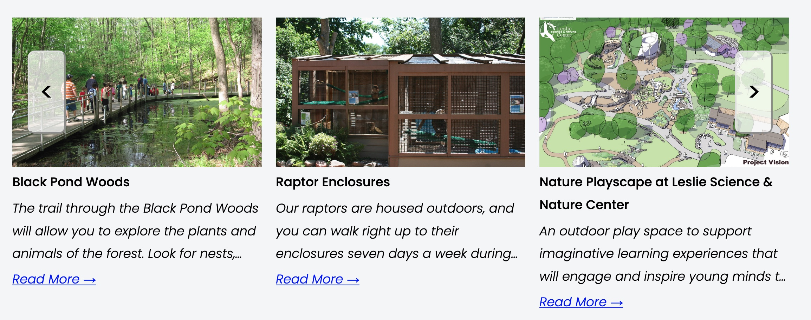
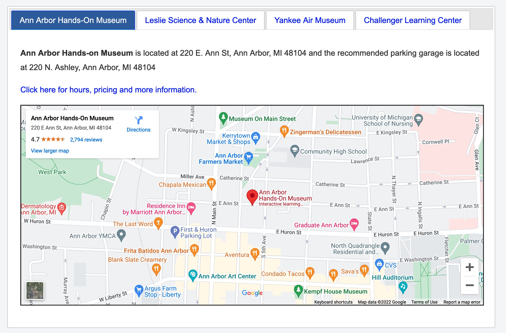
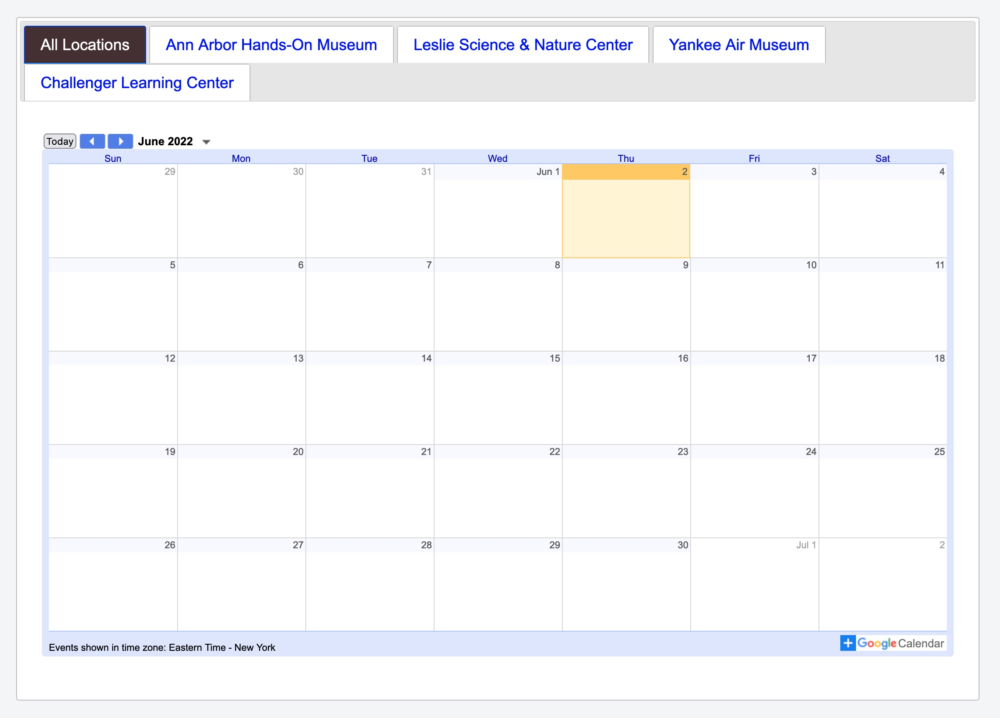
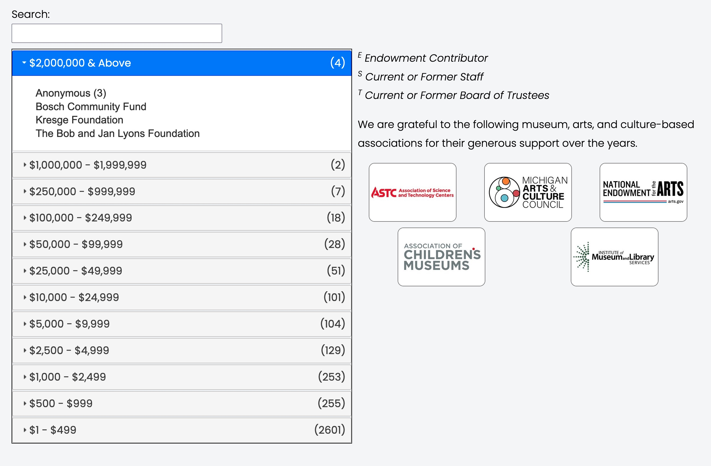
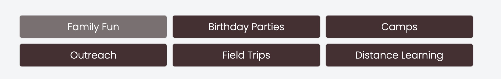

# Pick-a-Tool

This is a quick review of the tools available in the UIL Toolbox.   

## Carousel

## Filtered Grid

## Team Members

## Flip Boxes

## Frequently Asked Questions

## Address/Hours/Admission

## Locations

## Calendars

## Donor Wall

## Sub Menu

