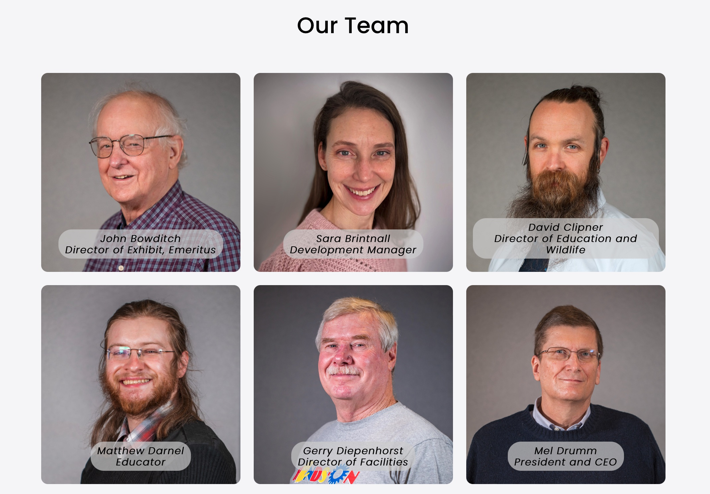

### Team Members

A list of team members found in the SquareSpace blog "Team Members" can be displayed via the custom function ***collectionControl*** by embedding a code block on a page as follows:

```
<script>
$(document).ready(function() {
  collectionControl(
    '#teamContainer',
    'team-members',
    'team', 
    {filter: false, 
     showcount: false,
     groups: '',
     showcats: false,
     findcats: '',
     dots: true}
  );
})
</script>
<div id="teamContainer"></div>
```

Attribute defaults specific to the ***team-members*** collection are: 

<table class="ws-table-all notranslate"> 
  <tbody>
    <tr class="tableTop">
     <td style="width:120px">Attribute</td>
     <td style="width:120px">Default</td>
     <td>Description</td>
    </tr>
    <tr>
      <td>filter</td>
      <td>false</td>
      <td>Defines if filtering checkboxes (or radio buttons) are to be displayed.  Valid values are "true" or "false".  </td>
    </tr>
    <tr>
      <td>groups</td>
      <td>''</td>
      <td>Overrides the default groups used for filtering.  This is a comma delimeted
      list of group names found in the categories spreadsheet.</td>
    </tr>
    <tr>
      <td>showcats</td>
      <td>false</td>
      <td>Defines if categories are shown for each blog entry. Valid values
      are "true" or "false".</td>
    </tr>
    <tr>
      <td>showcount</td>
      <td>false</td>
      <td>Defines if a count of filtered and total number of blog items is shown. Valid values are "true" or "false"</td>
    </tr>
    <tr>
      <td>findcats</td>
      <td>''</td>
      <td>Defines a comma delimted list of categories which will be included
      in the blog entries.</td>
    </tr>
  </tbody>
</table>

To make changes, edit the individual team members blog entry.  The order displayed is based on the default order within the blog, which is driven by the publication date. The team member postion is defined as a "Tag" entry in the blog entry settings. 

See **Control** for more information, calling syntax, parameters and attributes) on this function. 

### Team Members Backup Plan

In the event that the ***collectionControl*** function fails, or does not work due to changes in SquareSpace, or unforseen problems.  Replace the code block with a standard 
summary block defined as follows: 


**Example Screenshot**



**Team member detail**

