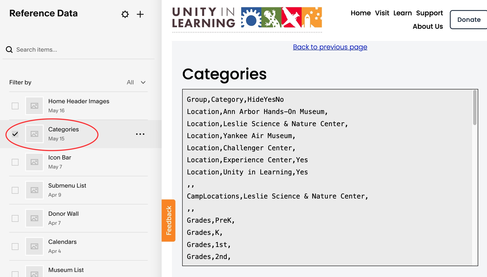

# Categories

This list of category names and groupings are used internally in various places.  Specifically, they are used in filtering grid displays.   However the use is not
limited to grids.  The category data is saved in a page code block in CSV format.

To edit categories, navigate to Reference-data -> Categories.  Open the first code
block and edit the content as CSV data.

**CSV Fields**

<table class="ws-table-all notranslate">
  <tbody>
    <tr class="tableTop">
    <td style="width:20px">Column</td>
    <td style="width:120px">Label</td>
    <td>Description</td>
    </tr>
    <tr>
    <td>A</td>
    <td>Group</td>
    <td>Valid grouping name
     </td>
  </tr>
  <tr>
    <td>B</td>
    <td>Category</td>
    <td>Category Name</td>
  </tr>
  <tr>
    <td>C</td>
    <td>HideYesNo</td>
    <td>Setting to Yes will hide his field.  The field will be ignored.</td>
  </tr>
  </tbody>
</table>

{: .theImage}
