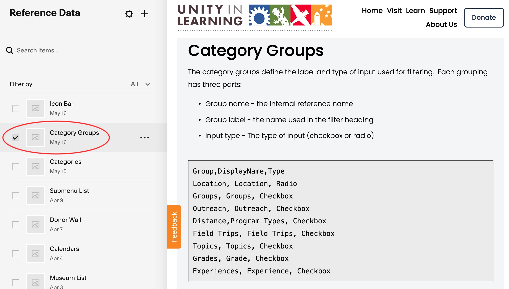

# Category Groups

The category groups define the label and type of input used for filtering.  Each grouping has three parts; (1) Group Name, (2) Display Label and (3) Input Type.

To edit categories, navigate to Reference-data -> Category Groups.  Open the first code
block and edit the content as CSV data.

**CSV Fields**

<table class="ws-table-all notranslate">
  <tbody>
    <tr class="tableTop">
    <td style="width:20px">Column</td>
    <td style="width:120px">Label</td>
    <td>Description</td>
    </tr>
    <tr>
    <td>A</td>
    <td>Group</td>
    <td>This name must be unique among all group names in column A.   It is used
      as the key in column A of the Categories CSV data file.
     </td>
  </tr>
  <tr>
    <td>B</td>
    <td>DisplayName</td>
    <td>This is the name that is displayed when referencing this group, generally
    in a grid filtering display.</td>
  </tr>
  <tr>
    <td>C</td>
    <td>Type</td>
    <td>Identifies if this group should be displayed as
    <strong>Radio</strong> buttons or <strong>Checkboxes</strong>
    valid values are:
      <ul><li>Radio</li>
        <li>Checkbox</li>
      </ul>
    </td>
  </tr>
  </tbody>
</table>

{: .theImage}
