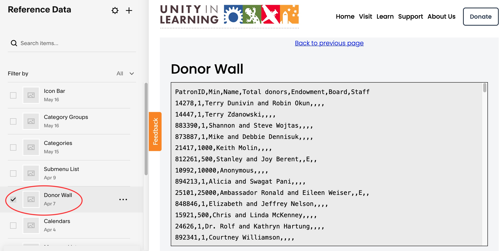

# Donor Wall

Lists of donors in accordian style by defined breakpoints.

To edit Donor Wall, navigate to Reference-data -> Donor Wall.  Open the first code
block and edit the content as CSV data.

**CSV Fields**

<table class="ws-table-all notranslate">
  <tbody>
    <tr class="tableTop">
    <td style="width:20px">Column</td>
    <td style="width:120px">Label</td>
    <td>Description</td>
    </tr>
    <tr>
    <td>A</td>
    <td>Person ID</td>
    <td>This is the internal id associated with the person.  The value is
    	not used, or displayed anywhere on the website.
     </td>
  </tr>
  <tr>
    <td>B</td>
    <td>Min</td>
    <td>This is the total accumulated dollar amount for this person or
    group.  It may be rounded to a breakpoint.   The program will round
and associate it with a breakpoint.   The actual dollar amount
is not displayed anywhere on the website.  It is only used to assocate
with a breakpoint and for sorting. </td>
  </tr>
  <tr>
    <td>C</td>
    <td>Total Donors</td>
    <td>This column is ignored and calculated internally</ul>
    </td>
  </tr>
  <tr>
    <td>D</td>
    <td>Endowment</td>
    <td>Expecting a value of "E" if this donor is an endowment contributor.</ul>
    </td>
  </tr>
  <tr>
    <td>E</td>
    <td>Board</td>
    <td>Expecting a value of "B" if this donor is, or has ever been a trustee.</ul>
    </td>
  </tr>
  <tr>
    <td>F</td>
    <td>Staff</td>
    <td>Expecting a value of "S" if this donor is, or has ever been a staff member.</ul>
    </td>
  </tr>
  </tbody>
</table>

{: .theImage}