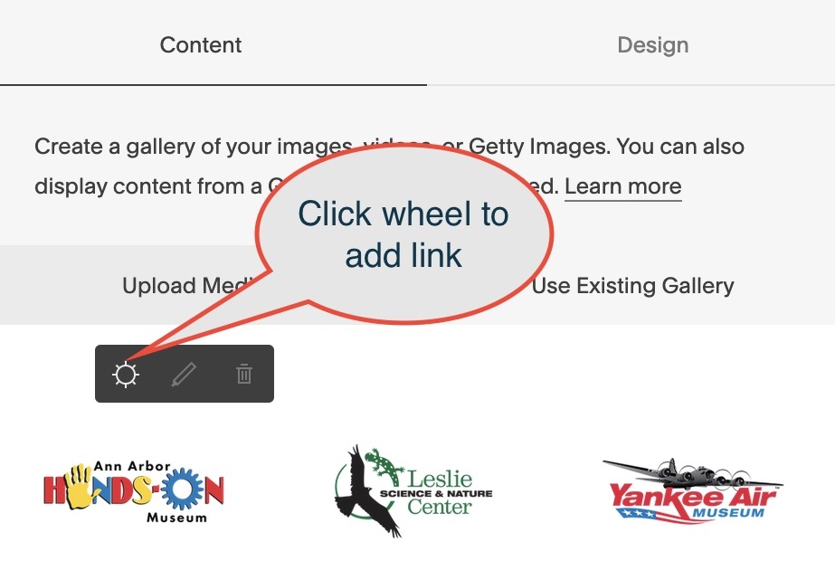

# Reference Data - Icon Bar

Icon Bars appear either attached to the top header image and/or the bottom footer on
all pages.  The icons displayed are saved in /reference-data/iconbar

The icon images are saved in a page gallery.  Add links to the "Clickthrough URL" by hovering over the icon (in edit mode) and clicking the wheel.

The order that icons are displayed is the order that they appear in the gallery.  There is
no way to hide an icon other than delete it from the gallery.

{: .theImage}

{: .theImage}