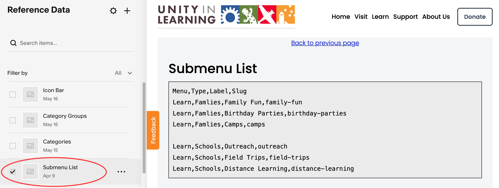

# SubMenu List

Menu bar for sub-menu items.  These are found on the "Learn" pages to help navigation between learn pages.  On mobile devices the menu is an wrapped in an accordion and compressed by default to save some space.  Content for submenu bar is in a code block
of the SubMenu List reference-data blog.

{: .theImage}

